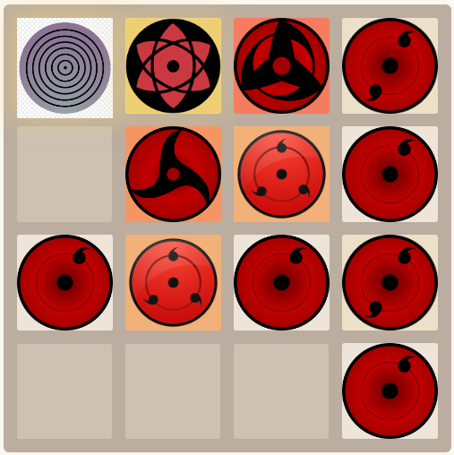

# Naruto 2048: Master of Dojutsu

A fork of the Open Source [GitHub Repository](https://github.com/gabrielecirulli/2048), re-built for custom use and hosted [here](https://slade2048.netlify.app). This variant of the game brings in the concept of 2 forms of dojutsu from the Naruto anime series: Sharingan and Rinnegan. Each level merges to something conceptually more powerful. Can you unlock them all?

## Prerequisites

In order to run or develop the game locally, you will need the following dependencies installing:

1. [GNU Make](https://www.gnu.org/software/make/) (Note: Make may already be available. Try running `make --version` in the terminal to check)
1. [Node Version Manager (nvm)](https://github.com/nvm-sh/nvm#installing-and-updating)

## Screenshot

<p align="center">
  
</p>

## Getting Started

Before you get started with anything else, make sure you initialize the project using the following command from the root of the repository:

```shell
$ nvm install
```

To run the game locally, simply run the following command from the terminal in the root of the repository:

```shell
$ make start
```

This will launch the game in the default browser. If you make any changes to the game code, you will need to refresh the page as hot reloading is not currently supported.

## Contributing

Changes and improvements are more than welcome! Feel free to fork and open a pull request. Please make your changes in a specific branch and request to pull into `master`! Please make sure the game fully works before sending the PR, as that will help speed up the process.

You can find the same information in the [contributing guide](CONTRIBUTING.md).

## License

2048 is licensed under the [MIT license](LICENSE.txt).

## Author

[Samuel Slade](https://github.com/sladesamuel/) is the maintainer for this repository.
